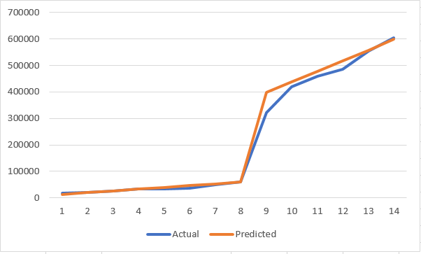

# SICP Exercise 1.24: Fermat method for prime testing

Modify the `timed-prime-test` procedure of Exercise 1.22 to use `fast-prime?` (the Fermat method), and test each of the 12 primes you found in that exercise. Since the Fermat test has Θ(log n) growth, how would you expect the time to test primes near 1,00,000 to compare with the time needed to test primes near 1000? Do your data bear this out? Can you explain any discrepancy you find?

## The 12 primes

```
100000000003
100000000019
100000000057
1000000000039
1000000000061
1000000000063
10000000000037
10000000000051
10000000000099
100000000000031
100000000000067
100000000000097
```

## The Fermat method

**Fermat's Little Theorem**: If *n* is a prime number and *a* is any positive integer less than *n*, then *a* raised to the *n*th power is congruent to *a* modulo *n*.

**Fermat test**: If *n* is not prime, most numbers (except Carmichael numbers) will satisfy the above relation, leading to the following algorithm: 

	1. Pick a random number less than *n*.
	2. Compute `a^n mod n`.
	3. If `a^n mod n != `a` then `a` is certainly not prime. If the condition holds then the chances are good that `a` is prime.
	4. Repeat steps 1-3 to be more confident that `a` is prime.

To implement the Fermat test we need a fast method of computing `a^n mod n`.
Handily, SICP supplies the algorithm for us:

```scheme
(define (expmod base exp m)
  (cond ((= exp 0) 1)
        ((even? exp)
         (remainder
          (square (expmod base (/ exp 2) m))
          m))
        (else
         (remainder
          (* base (expmod base (- exp 1) m))
          m))))
```

Since computing `a^n` and then taking `mod n` would be computationally excessive (see Exercise 1.25),
the algorithm uses [Fast modular exponentiation](https://en.wikipedia.org/wiki/Modular_exponentiation), which takes the modulus multiple times as intermediate steps, using the fact that e.g. `ab mod n = (a mod n)(b mod n) mod n`.

SICP provides the following code for performing a single Fermat test:

```scheme
(define (fermat-test n)
  (define (try-it a)
    (= (expmod a n n) a))
  (try-it (+ 1 (random (- n 1)))))
```

Scheme's `(random m)` procedure returns [0, m-1],
but we want [1, m-1],
so we use `(random m-1)+1` to get the desired range.

And the following procedure performs the test multiple times:

```scheme
(define (fast-prime? n times)
  (cond ((= times 0) true)
        ((fermat-test n) (fast-prime? n (- times 1)))
        (else false)))
```

Note that the procedure short-circuits and fails immediately when any Fermat-test fails. 

## Answer

Timings before adding `fast-prime?`

```
100000000003 *** 26500
100000000019 *** 28500
100000000057 *** 31500
1000000000039 *** 95500
1000000000061 *** 98000
1000000000063 *** 85500
10000000000037 *** 337000
10000000000051 *** 259000
10000000000099 *** 278000
100000000000031 *** 969500
100000000000067 *** 967500
100000000000097 *** 944000
```

I encountered some problems with DrRacket's pseudo-random number generator. It appears that it doesn't support large numbers.
The limit turns out to be 4294967087, which seems arbitrary. After some Googling I see that this number is [the largest "safe prime" that is smaller than 2^32 - 1](https://stackoverflow.com/questions/38296701/whats-the-significance-of-4294967087-as-an-argument-limit-to-rackets-random). 

```
> (random 4294967087)
999324371
> (random 4294967088)
. . random: contract violation
  expected: (or/c (integer-in 1 4294967087) pseudo-random-generator?)
  given: 4294967088
```

I fix this by defining a new `big-rand` procedure [that concatenates two random numbers](https://crypto.stackexchange.com/questions/27430/how-to-generate-a-large-random-number-from-smaller-ones), and then takes the modulus to get the desired range.
To get the desired properties we must use a power of two, so I chose 2^31, which is 2147483648. I came up with the following, but I'm pretty sure there are some flaws (like non-uniform distribution):

```scheme
(define (big-random n)
  (remainder(+
             (* 2147483648 (random 2147483648))
             (random 2147483648))
            n))
```

[Alternative solution to the Racket `random` issue from Scheme wiki:](http://community.schemewiki.org/?sicp-ex-1.24)

> add: `(#%require (lib "27.ss" "srfi"))` to gain access to the random-integer procedure.

Now modify `fermat-test` to use `big-random` instead of `random`,
and change any usages of `prime?` with `fast-prime?`.
The number of iterations of the Fermat test is not given in SICP,
and [Stack Overflow doesn't have a good answer either](https://math.stackexchange.com/questions/2598243/how-many-times-should-fermats-primality-test-be-applied), so I tried with 100/1000/10000 iterations.

## Scheme code

```scheme
(define (square n) (* n n))

(define (timed-prime-test n)
  (newline)
  (display n)
  (start-prime-test n (runtime)))

(define (start-prime-test n start-time)
  (if (fast-prime? n 10000) ; switch between prime? and fast-prime? here
      (report-prime (- (runtime) 
                       start-time))))
                       
(define (report-prime elapsed-time)
  (display " *** ")
  (display elapsed-time))

(define (expmod base exp m)
  (cond ((= exp 0) 1)
        ((even? exp)
         (remainder
          (square (expmod base (/ exp 2) m))
          m))
        (else
         (remainder
          (* base (expmod base (- exp 1) m))
          m))))

(define (fermat-test n)
  (define (try-it a)
    (= (expmod a n n) a))
  (try-it (+ 1 (big-random (- n 1)))))

(define (fast-prime? n times)
  (cond ((= times 0) true)
        ((fermat-test n) (fast-prime? n (- times 1)))
        (else false)))

(define (big-random n)
  (remainder(+
             (* 2147483648 (random 2147483648))
             (random 2147483648))
            n))

(timed-prime-test 100000000003)
(timed-prime-test 100000000019)
(timed-prime-test 100000000057)
(timed-prime-test 100000000007); not prime
(timed-prime-test 1000000000039)
(timed-prime-test 1000000000061)
(timed-prime-test 1000000000063)
(timed-prime-test 1000000000067); not prime
(timed-prime-test 10000000000037)
(timed-prime-test 10000000000051)
(timed-prime-test 10000000000099)
(timed-prime-test 10000000000199); not prime
(timed-prime-test 100000000000031)
(timed-prime-test 100000000000067)
(timed-prime-test 100000000000097)
(timed-prime-test 100000000000101); not prime
```

I added some non-prime numbers to check that the algorithm isn't completely wrong.

**Output 10000 iterations**
```
100000000003 *** 565000
100000000019 *** 428500
100000000057 *** 446500
100000000007
1000000000039 *** 419500
1000000000061 *** 463500
1000000000063 *** 420000
1000000000067
10000000000037 *** 456500
10000000000051 *** 433500
10000000000099 *** 519500
10000000000199
100000000000031 *** 598500
100000000000067 *** 594000
100000000000097 *** 493500
100000000000101
```

**Output 1000 iterations**
```
100000000003 *** 94500
100000000019 *** 47500
100000000057 *** 56000
100000000007
1000000000039 *** 46500
1000000000061 *** 56000
1000000000063 *** 51500
1000000000067
10000000000037 *** 73000
10000000000051 *** 47500
10000000000099 *** 62500
10000000000199
100000000000031 *** 54000
100000000000067 *** 57500
100000000000097 *** 43500
100000000000101
```

**Output 100 iterations**
```
100000000003 *** 3500
100000000019 *** 2500
100000000057 *** 2500
100000000007
1000000000039 *** 4000
1000000000061 *** 3000
1000000000063 *** 17500
1000000000067
10000000000037 *** 3000
10000000000051 *** 3500
10000000000099 *** 3000
10000000000199
100000000000031 *** 3500
100000000000067 *** 3000
100000000000097 *** 17000
100000000000101
```

It's not obvious how the runtime increases as *n* increases,
so here are some additional results using some smaller primes too, with 10000 iterations for better timing results:

```
113 *** 17000
1013 *** 20500
10009 *** 25500
100019 *** 33500
1000037 *** 34000
10000019 *** 37500
100000049 *** 49500
1000000033 *** 59000
10000000061 *** 321500
100000000069 *** 420000
1000000000063 *** 458500
10000000000129 *** 486000
100000000000099 *** 555000
```

There is an abrupt change in the timings when the numbers get larger.
I'm guessing it has something to do with the internal number types
used by DrRacket. Maybe it switches from int64's to BigInteger? [Edit: It seems like Racket numbers are stored as tuples of 32 bit integers. The abrupt change happens when we go higher than 2^32-1.]

Back to the Microsoft Excel Method for Complexity Analysis.
I expect the runtime of `(fast-prime? n)` to be
proportional to `log2(n/2)` (since we're taking random numbers in the range, on average they will be n/2. This method is only approximately correct due to the non-centered distribution of the logarithm.).

```
Size			Time	Predicted		Constant
n				t		log2(n/2)*C		C
-----------------------------------------------
113				17000	13640,35792		2000
1013			20500	19968,83692	
10009			25500	26578,02044	
100019			33500	33219,82912	
1000037			34000	39863,2439	
10000019		37500	46506,99881	
100000049		49500	53150,85093	
1000000033		59000	59794,7058	
10000000061		321500	398631,3715		12000
1E+11			420000	438494,5085	
1E+12			458500	478357,6457	
1E+13			486000	518220,7828	
1E+14			555000	558083,9199	
1E+15			604000	597947,0571	
```
Because of the abrupt change I have used two different proportionality constants.



To me the predictions look reasonable for these primes,
however, I also tested with 2305843009213693951 and got a runtime of 905500, which does not fit the pattern. This might be related to Racket's internal number storage for big integers, meaning that proportionality only holds for number tuples of the same length.

As always, [also check out the Scheme Wiki for this exercise](http://community.schemewiki.org/?sicp-ex-1.24).

## Go solution

TODO